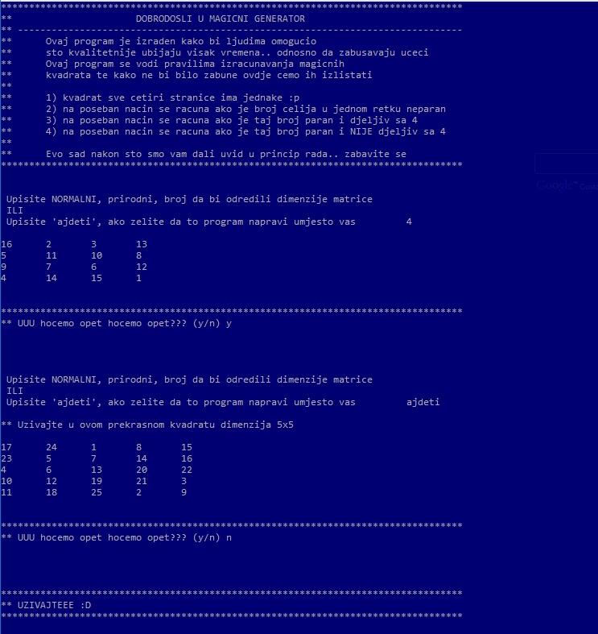

Magicni generator
===================

C program za generiranje svih vrsta magicnih kvadrata
-------------------

Fleksibilan program napisan u c-u gdje korisnik zadaje velicinu stranice, a program generira magicni kvadrat.  
Ukoliko korisnik nema pojma koliki bi kvadrat htio generirati, program mu nudi opciju nasumicno izabranog broja. 
Nakon izvrsenja korisniku je dana opcija da se nastavi igrati dalje ako to zeli. 
Nacin rjesavanja magicnih kvadrata ovisi o njegovim dimenzijama:

 1. nacin - stranice su neparne (3x3, 5x5, 17x17..) (**odd order**)
 2. nacin - stranice su parne, ali **nisu** djeljive s 4 (6x6, 10x10, 14x14..) (**even order**)
 3. nacin - stranice su parne i djeljive su s 4 (4x4, 8x8, 12x12..) (**doubly even order**)

Algoritmi koristeni za rjesavanje sva tri slucaja mogu se pronaci na: http://mathworld.wolfram.com/MagicSquare.html 

___

> **Rant**
>
ovaj program je nastao kako bi se pokazalo ljudima dvije stvari a to su:
 - da magicni kvadrat moze imati i paran broj celija u stranicama a ne samo 3x3, 19x19.. i da se svejedno moze rjesiti
 - da, ukoliko je kvadrat nekih **normalnih** dimenzija, moze se generirati u c-u i bez koristenja pointera i prckanja po memoriji

